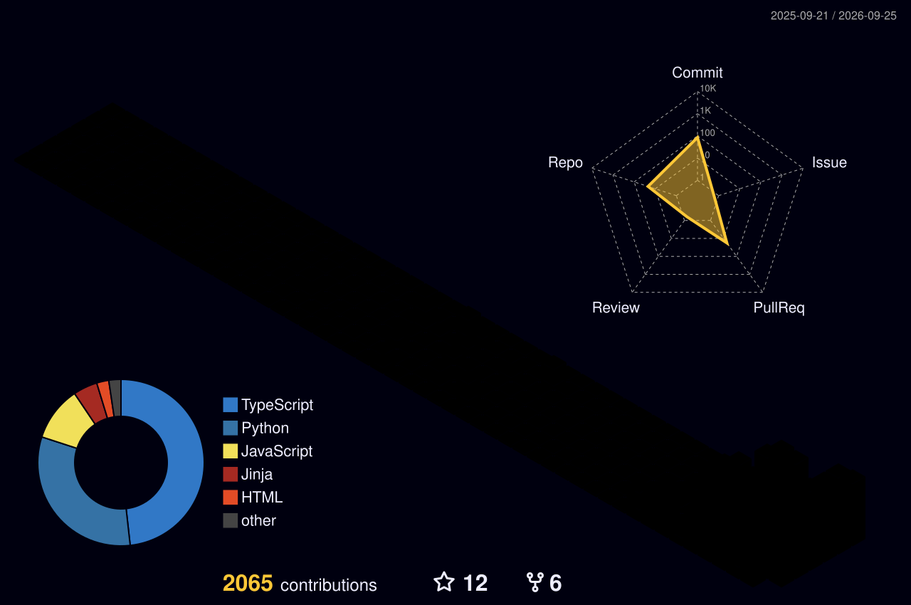

#   Hi there 

- 💻 Full Stack Developer | AI | Crypto
- 📍 Chennai, India
- 📚 Currently learning and exploring new technologies..
- 🛠️ Building AI-powered products for real-world problems..

Professional Experience 🧑🏻‍💻

 

### 🚀 Full-Stack Developer & AI Enthusiast

🎯 **Expertise Areas:**
- **Full-Stack Development:** React, Node.js, TypeScript, FastAPI
- **AI & Machine Learning:** LLM apps, Gemini, RAG pipelines
- **Mobile Development:** Flutter, Dart
- **Data & Infrastructure:** PostgreSQL, Docker, Analytics

### 🛠️ Technical Skills & Technologies

  

#

Connect With Me 📫

 

  &nbsp;
  &nbsp;
  

